# 基于Springboot的民宿在线预定平台

## Springboot-0078


## 技术栈

Springboot mybatisplus vue mysql maven


## 数据库表(13张)


## 功能介绍

```properties
台管理员功能有个人中心，用户管理，民宿信息管理，民宿分类管理，我的收藏管理，系统管理，订单管理等。

用户可以注册登录，查看民宿和预定名宿,以及加入购物车, 查看民宿资讯和在线咨询客服。
```


## 图片

### 前台


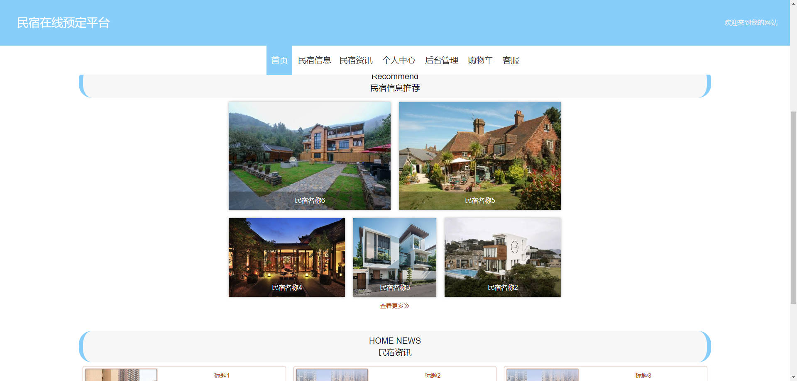

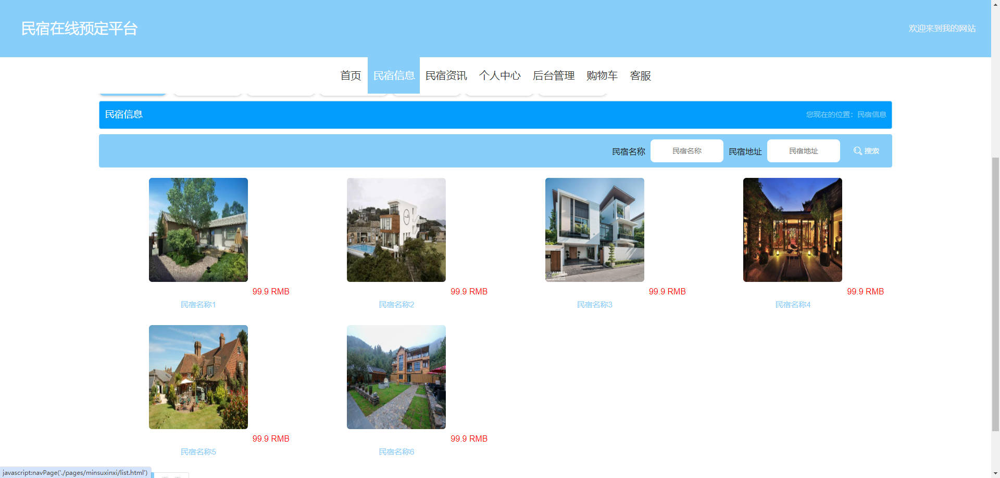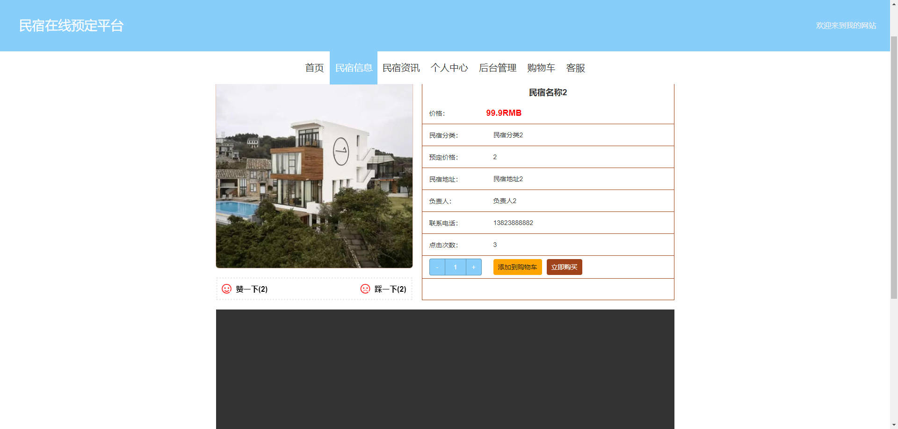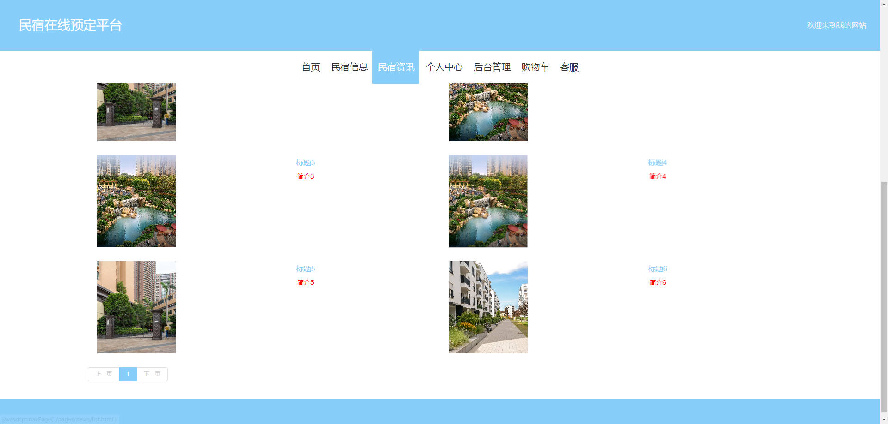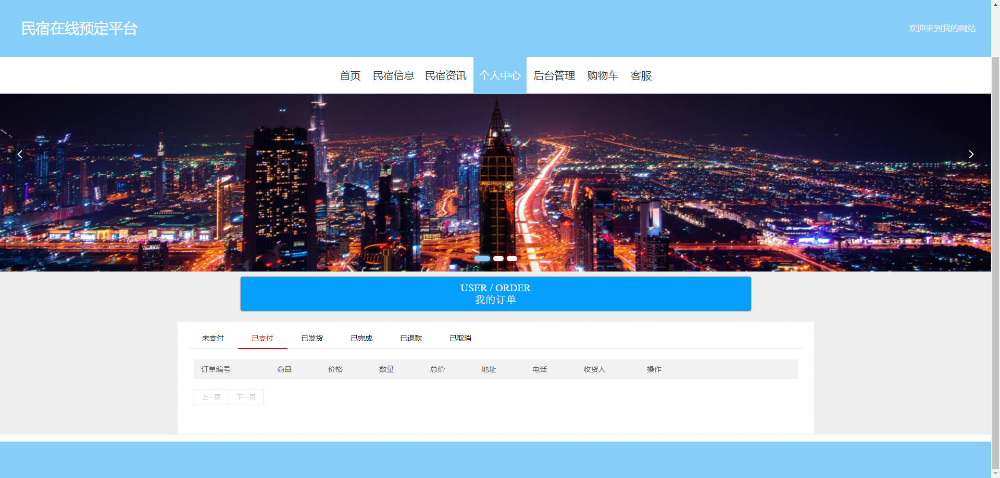

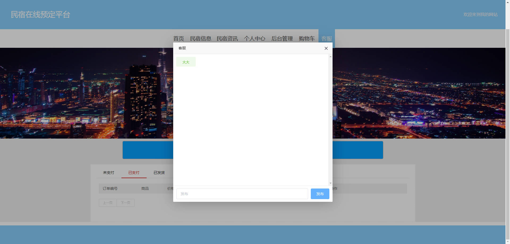

### 后台


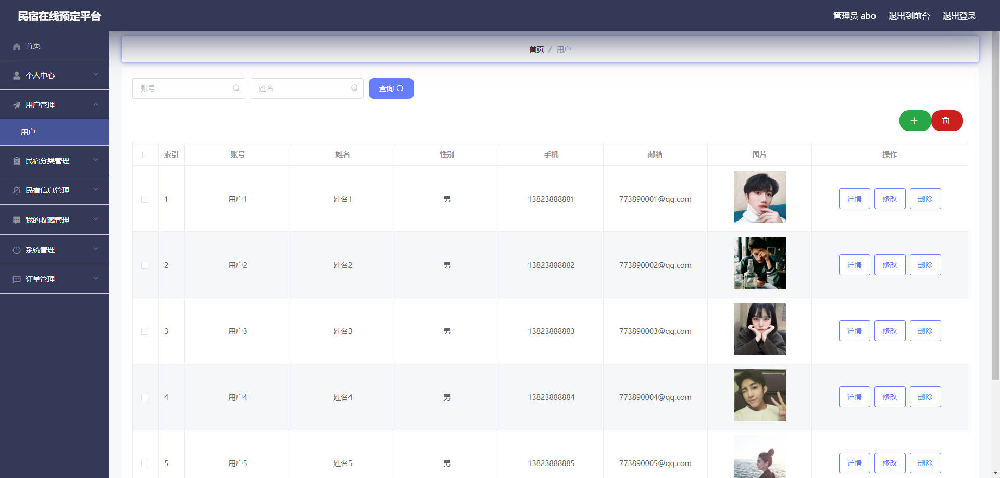

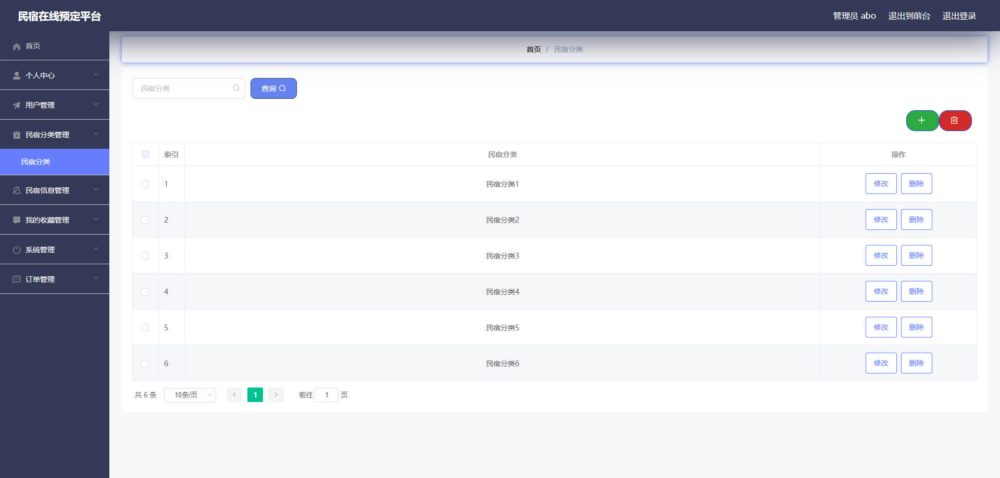

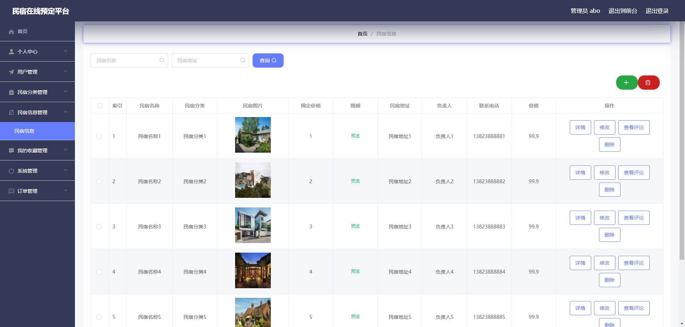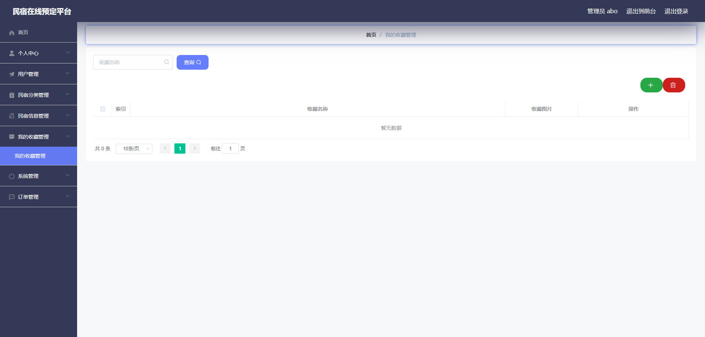


## 访问路径

### 前台

```properties
http://localhost:8080/springbootr0p7i/front/pages/login/login.html

账号 用户6
密码 123456
```

### 后台

```properties
http://localhost:8080/springbootr0p7i/admin/dist/index.html#/login

账号 abo
密码 abo
```


## 功能图

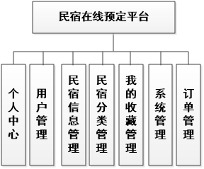


## 文档目录

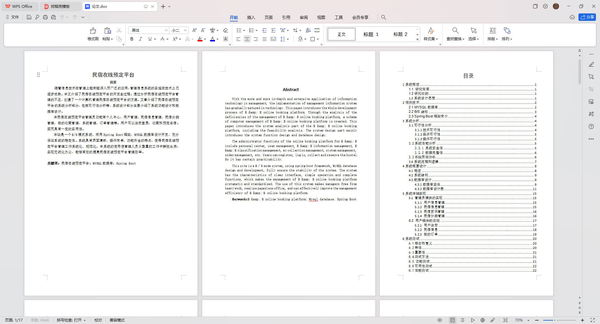


## 打赏或交流


